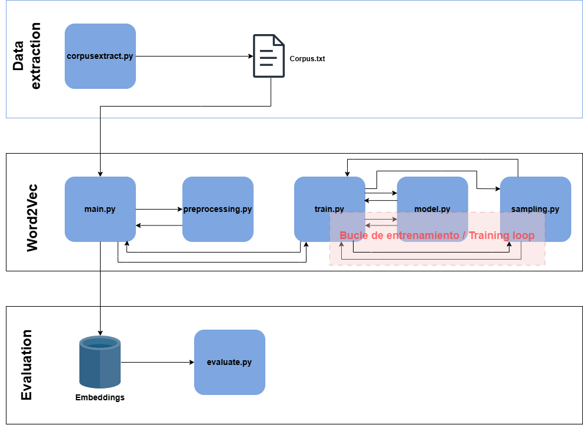
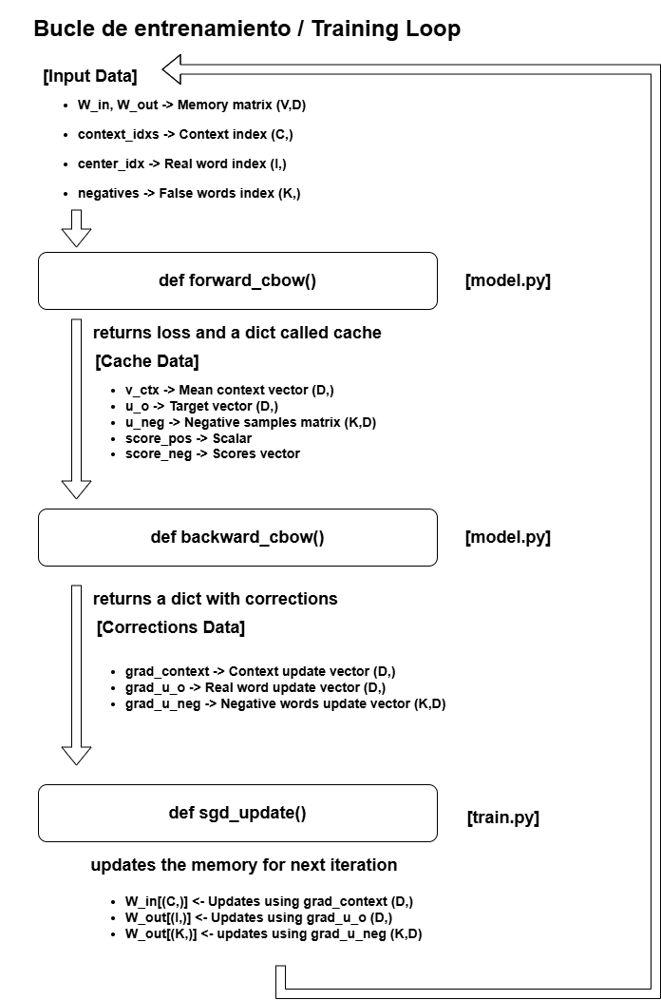

# Word2VecWithNumpy - Un pequeñísimo modelo en local
 
Implementación de **CBOW con negative sampling** en NumPy puro, sin frameworks
de deep learning (PyTorch/TensorFlow), como ejercicio para entender de primera
mano todo lo relacionado con el modelo. Desde la extracción de datos para crear
el corpus, pasando por el diseño y desarrollo del algoritmo a puro Python y Numpy,
hasta su comprobación y evaluación del rendimiento del modelo.

Este proyecto nace de una pregunta de una interview para una posición Internship 
en JetBrains (ML Engineering Internship). Al no poder presentarme a dicha entrevista 
por cuestiones de tiempo y responsabilidades universitarias, he decidido desarrollar
este proyecto como un summer side-project. El principal objetivo de este proyecto es
entender todo el sistema Word2Vec y, quizás en un futuro, esta sea la base de otro
proyecto, donde pueda implementar este motor para un caso práctico y todo desde local. 
(con las limitaciones que esto implica, al ser local).

Siendo sincero, y teniendo en cuenta mi background de estudiante de Ingeniería de Datos (Grado en Ingeniería y Sistemas de Datos en la UPM). Parte del sistema ha sido muy difícil de desarrollar y comprender.
- La parte de ingeniería dentro del word2vec **(preprocesing.py y sampling.py)** no me supuso mucho esfuerzo, ya que este tipo de trabajo se ha cubierto muy bien en mi grado con asignaturas y proyectos de asignaturas.
- La parte de matemática pura **(model.py y evaluate.py)** ha sido en su mayoría todo un reto. En la carrera hemos 
profundizado en las matemáticas que hay detrás de un modelo, pero no hasta el punto de entender lo que un graduado en matemáticas entendería :P. Por tanto, ayudándome del paper original de Mikolov, papers que explican el paper de 
Mikolov y herramientas de IA como Gemini, conseguí medio-entender el flujo de los datos y como iban actualizándose los pesos, gradientes y matrices en cada entrenamiento. Aunque este no es mi punto fuerte.
- En este proyecto también aprendí a hacer tests, cosa que no había hecho de forma tan profunda anteriormente.
- Además, he comprendido el por qué del **Negative Sampling y la Teoría de los Grandes Números**, sin estos 2 conceptos el entrenamiento del modelo sería eterno.
- Además de lo dicho anteriormente, he aprendido a organizar, limpiar y dejar muy presentable un sistema.

Mi flujo de trabajo para este proyecto de aprendizaje ha sido básicamente de **ingeniería inversa**, donde iba desmontando poco a poco el modelo para construirlo yo y finalmente entender todo el flujo.

- Primero de todo reuní los papers (están en la carpeta de papers del proyecto) que usaría como referencia.
- No estoy loco, y por eso usé Claude para este proyecto. Teniendo el objetivo de lo que quería hacer claro (desarrollar el algoritmo Word2Vec a mano usando Numpy y sin ninguna otra librería externa y luego probar el algoritmo) le pedí una plantilla. Esta plantilla contenía un esquema de carpetas para organizar el proyecto de forma básica, el nombre de las funciones que tendría que desarrollar junto con una pequeña descripción de que debían hacer junto con sus args y referencias a los papers originales.
- Con este esqueleto comencé a trabajar, me apoyé en mis conocimientos de ingeniería de datos, programación, papers y documentación oficial para desarrollar una base del proyecto. Para las partes más matemáticas use IAs como Gemini para que me explicase paso a paso cómo debería fluir por dentro de las funciones y entre funciones los datos, ya que la matemática detrás es muy extensa y conseguir entender el funcionamiento ya es todo un reto para mi, ya que mi punto fuerte es la ingeniería, no las matemáticas muy avanzadas. 
- Una vez montada la base, me dediqué a montar tests que me sirvieron para 2 cosas principalmente: Primero para comprobar q mis funciones iban bien y luego para entender del todo bien el funcionamiento de las partes más matemáticas del sistema.
- Después de pasar todos los test y comprobar que el modelo funciona mas o menos bien con un corpus extraido de wikipedia, me puse manos a la obra para dejar el proyecto presentable y reproducible.

## Futuras ideas y avances para el proyecto
Aparte de pulir y dejar más profesional este README.md, tengo pensado modificar un poco más el código base, ya que tengo un código en "espaniglish", esto provoca que seguir el código resulta en una tarea algo difícil para alguien aparte de mí, pero por ahora lo dejo disponible ya que funciona sin problema y es reproducible.

Pienso en sacarle alguna utilidad en un futuro a este motor, aunque sea pequeña (análisis de sentimiento, un pequeño ChatBot local...), pero por ahora me queda trabajo, ya que quiero dejar este proyecto totalmente presentable y reproducible tanto en Linux, Windows y MacOS. Me planteo incluso la posibilidad de poder dockerizarlo.

## Instalación
 
```bash
pip install -r requirements.txt
 
VersiónPython: 3.12.10
```
 
## Uso
 
1. Coloca tu corpus de texto en `data/corpus.txt`.
2. Ajusta hiperparámetros en `main.py` si quieres (dimensión, ventana, epochs...).
3. Entrena:
```bash
python main.py
```
 
4. Prueba los embeddings resultantes:
```bash
python evaluate.py
```
 
## Arquitectura del proyecto
 
El sistema completo va desde la extracción del corpus hasta la evaluación de
los embeddings entrenados, pasando por el módulo `word2vec` donde vive el
bucle de entrenamiento:
 

 
## Estructura del proyecto
 
```
Word2VecWithNumpy/
├── images/                       
├── papers/                       # papers usados para el desarrollo
├── word2vec-numpy/
    ├── data/
        └── corpus.txt            
    ├── embeddings/               # se genera al entrenar el modelo
        ├── W_in.npy
        └── word2idx.json
    ├── tests/                    # se prueban todas las funciones de word2vec/
        ├── __init__.py
        ├── test_model.py
        ├── test_preprocessing.py
        ├── test_sampling.py
        ├── test_train.py
    ├── word2vec/                 # motor
        ├── __init__.py
        ├── preprocessing.py      # tokenizar, vocabulario, subsampling
        ├── sampling.py           # pares (contexto, centro) + negative sampling
        ├── model.py              # inicialización, forward, gradientes (CBOW)
        └── train.py              # el bucle de entrenamiento (SGD)
├── .gitignore
├── corpusextract.py              # archivo para volcar datos de wikipedia para el modelo
├── evaluate.py               # similitud coseno, vecinos más cercanos
├── LICENSE
├── main.py                   # orquesta todo el sistema
├── README.md
└── requirements.txt
```
 
## Bucle de entrenamiento / Training loop
 
Detalle del bucle de entrenamiento (`forward_cbow` → `backward_cbow` →
`sgd_update`) y las formas de los tensores que se pasan entre cada etapa:
 

 
## Notas
 
- Variante: **CBOW** (varias palabras de contexto predicen la palabra centro).
- Optimización: **negative sampling** en vez de softmax completo (más rápido,
  y evita normalizar sobre todo el vocabulario en cada paso).
- Todo el forward/backward está implementado a mano con NumPy — sin autograd.
- Se han usado los papers de Mikolov junto con otros explicativos y de contexto como referencias.